# rsa 密钥对生成示例

我们的远程GIT访问时都需要用到ssh-key密钥对来实现身份验证，比如TortoiseGit和PyCharm/IDEA/WebStorm都需要rsa密钥对。

生成rsa密钥对有多种方法，比如linux下的ssh-keygen和windows下的PuttyGen。

然而两者生成的密钥对格式不同，无法直接通用，而TortoiseGit需要用到PuttyGen生成的.ppk文件，而PyCharm/IDEA/WebStorm等需要id_rsa文件。

为此需要做些处理，以便两者能共用同一对rsa密钥对。

## 生成密钥对

登录Linux服务器，用以下命令生成rsa密钥对：
ssh-keygen -t rsa

```console
$ ssh-keygen -t rsa
Generating public/private rsa key pair.
Enter file in which to save the key (/home/zhulp/.ssh/id_rsa): /tmp/id_rsa
Enter passphrase (empty for no passphrase):
Enter same passphrase again:
Your identification has been saved in /tmp/id_rsa.
Your public key has been saved in /tmp/id_rsa.pub.
The key fingerprint is:
1e:28:e6:9e:ee:58:e7:dd:06:88:f2:54:02:a1:d6:d4 zhulp@rhino
The key's randomart image is:
+--[ RSA 2048]----+
|  .o.            |
| .+  E           |
|.. o             |
|.   . ..         |
|    o+..S        |
|  .oo.....       |
|   +o . ..       |
|   +.+ . ..      |
|  .o= . ...      |
+-----------------+
$ ls id_rsa* -l
-rw------- 1 zhulp zhulp 1671 7月  24 13:41 id_rsa
-rw-r--r-- 1 zhulp zhulp  393 7月  24 13:41 id_rsa.pub
```

因为我们生成密钥对是用了在windows下开发所用，所以在生成密钥对的时候指定生成路径，以免覆盖服务器上当前用户的默认密钥对，如上例中的：/tmp/id_rsa。

生成的id_rsa是私钥，用于客户端认证时加载，id_rsa.pub是公钥，需要上传到服务器。这两个文件请下载到自己的windows机器的以下目录待后续处理，位于C盘用户目录下，形式根据不同的Windows版本可能稍有不同，在这个目录下找.ssh目录，如果没有，则需要新建一个。


你如果尝试过会发现，在文件管理器里创建一个名叫".ssh"的目录是无法成功的，可以打开cmd窗口，在命令行中cd到自己的用户目录下（貌似打开cmd时自动就在这个目录下），用命令md .ssh，如下：


目录创建成功后，将id_rsa和id_rsa.pub这两个文件扔进这个目录中。PyCharm/IDEA/WebStorm等IDE工具会到这个目录下找这两个文件。

## 生成ppk格式私钥

在安装过TortoiseGit的机器上应该都会有一个PuTTYGen的工具，打开之：

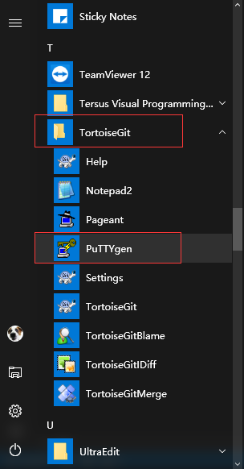

打开后不要点Generate，而是点Load，加载之前生成的私钥：

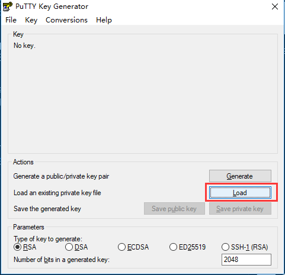

打开加载对话框时，选中右下角"All Files"，再选择之前生成并下载到Windows机器的id_rsa。


加载私钥后如果顺利就该弹出对话框告诉你一切成功，点确定关闭对话框。


点"Save private key"，保存为ppk文件

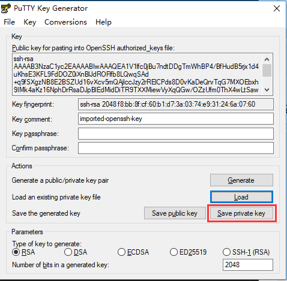

此时会弹出告警，说是否保存未受密码保护的密钥，为了避免今后每用一次都需要输密码，这里就直接点是。

当然，如果你实在没有安全感，或者是受虐狂体质，也可以点否，然后在主界面的"Key passphrase"中输入密码再重新保存。

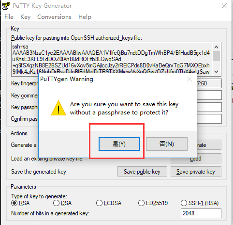

在后续窗口中选择一个目录，输入一个文件名，然后确定，即可生成ppk格式的私钥，到这时可以把PuTTYGen关掉了。

这里请 **一定一定一定** 记住你保存的位置和文件名，否则下次用的时候找不到，你还得再来一遍。


## 添加公钥到GitLab

打开GitLab并以自己的帐户登录，按下图数字1,2,3顺序点击，找到添加ssh key的地方，并在4号框中粘贴进之前生成的id_rsa.pub文件的内容，看下示例中的格式，别找错文件，再点按钮5："Add key"，即完成添加。

其中的标题用于区分不同的ssh-key，只要不与已有的相同即可，不用太在意。

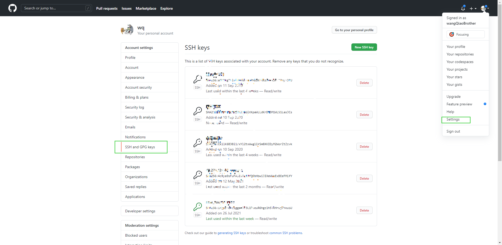

## TortoiseGit中使用私钥

在TortoiseGit目录中找到Pageant，如下图：

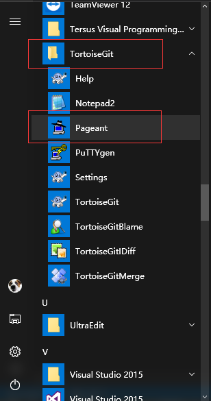

点击运行后好像不会出现界面，可以在任务栏托盘中找到它：


右击任务栏托盘中Pageant的图标，并在弹出菜单中选择"Add Key"

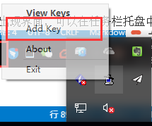

在弹出的文件选择对话框中选择之前生成的ppk私钥，之前说 **一定** 记住ppk私钥的文件名和位置，应该没这么快忘吧。


也可以在Pageant右键菜单中选"View Keys"，查看确认你的私钥添加成功：

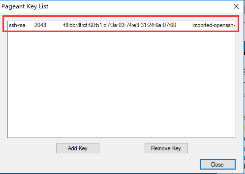

注意：Pageant工具好像没办法自动加载ppk私钥，也就是说每次电脑启动后如果要用TortoiseGit都得手工加载私钥这么一次。谁如果知道怎么样自动加载，记得告诉我让我知道。

## 测试验证

登录GitLab，并打开任意一个工程，找到URL并选择复制，注意，这里要SSH形式的URL，而非HTTP形式的。


在文件管理器中，选个目录在空白处点右键选Git Clone...


在弹出对话框的URL中粘贴入刚复制的URL，并确定。

小提示，这里一般都会自动填入在剪贴板中的内容，如果你复制了URL再打开Git Clone，就省了粘贴这一步了。

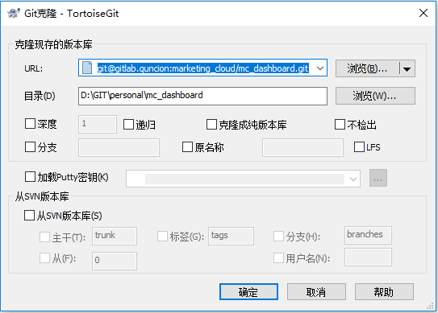

如果TortoiseGit成功将远程库克隆到本地，则ppk私钥已成功生效。


用PyCharm/IDEA/WebStorm等IDE工具将刚刚克隆好的目录打开。


右键点击工程根目录，并依次选择Git-Repository-Pull...


在弹出的窗口中选择你希望拉取的分支并点"Pull"按钮开始拉取。


不管结果有没有拉取到新的变更，只要没有要求输入密码，就说明成功了。


## 完成

至此，TortoiseGit和PyCharm/IDEA/WebStorm等IDE工具均已可直接使用GIT不再会提示密码。

## 2021-03-31 更新

TortoiseGit 使用 pageant 密钥助手实在是太麻烦了，使用时经常会忘记打开，有没别的方法，比如直接使用 .ssh 目录下的 id_rsa 密钥？

答案是：有的。

打开命令行，输入 ssh，看是否有这个命令。


如果是有这样的显示，则说明是安装过 ssh 命令的，可以直接用。

如果是提示“'ssh' 不是内部或外部命令，也不是可运行的程序或批处理文件。"，则说明没有安装。


需要按下述方法先安装上：

先用鼠标在开始菜单上右击，然后选择“应用和功能”。


再点击应用和功能对话框的“可选功能”。


点击“添加功能”。


在搜索框输入"OpenSSH"，并选择OpenSSH 客户端，然后点击安装按钮。

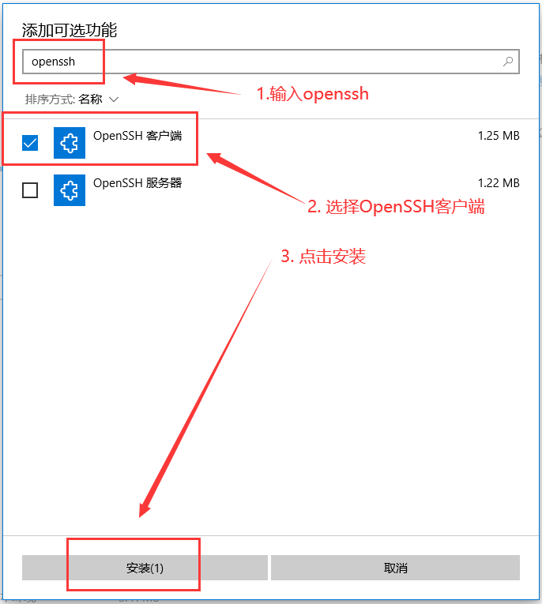

有此显示说明安装完成。


然后，再打开命令行窗口，确认ssh命令已经安装成功。


在任意目录右键，并选择TortoiseGit -> 设置

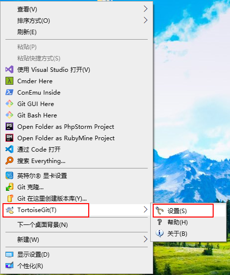

在网络-> SSH 客户端中，点击选择按钮。

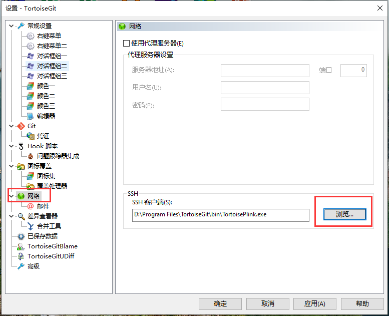

在C:\Windows\System32\OpenSSH目录，选中ssh.exe命令，并点击打开。

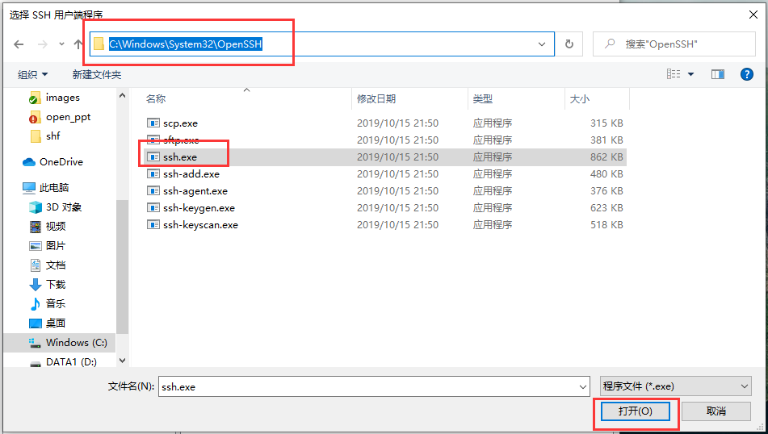

确保TortoiseGit 网络设置中的SSH客户端指向刚刚所选的ssh命令。

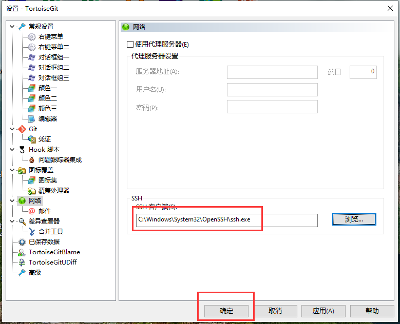

点击确定设置完成后，关闭以前用的Pageant，然后尝试去pull 任意的Git仓库，看看是否生效吧。

